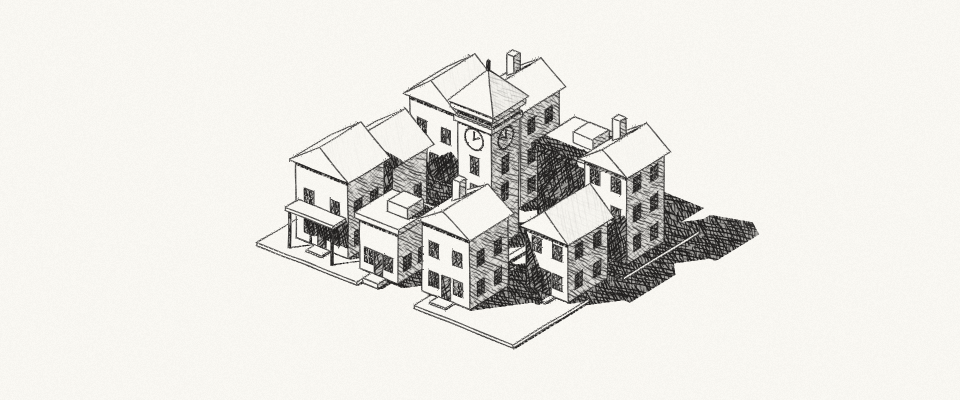

# Sketchy

Pencil shading for 3D scenes. Zooming adds new hatch strokes between existing ones; screen-space outlines give the edges a slight pencil wobble.

## [Try the demo](https://otdavies.github.io/sketchy/)

## How it works

The hatching builds on [Rune Skovbo Johansen's fractal dithering](https://runevision.com/tech/dither3d/). Each stroke keeps the same identity as the pattern subdivides, so its length and pressure don't reset at every scale change. Darker areas build up overlapping strokes; fully lit areas stay clear.

The outlines use depth and normal samples to find edges, then fit a short line through nearby samples. Width and wiggle are measured in pixels. This follows the screen-space approach described in [Manifold Garden's rendering retrospective](https://history.siggraph.org/wp-content/uploads/2022/08/2020-Talks-Brussee_Thats-a-wrap_-Manifold-Garden-rendering-retrospective.pdf), with a local line fit and pencil shading added here.

With **Hold drawings** on, the whole image updates at most ten times a second. Zooming gives each drawing small stroke variations. There is no blending between frames.

## Controls

- Drag to orbit; scroll or use **Zoom** to move closer.
- **Scene** switches between the city, traffic, sculpture and flat tests.
- **Pencil fit** adds outline wiggle. **Stable fit** removes it.
- **More controls** contains the shading comparisons, shadow views and quality settings.

## Research and source

[Hatching](docs/hatching.md) · [Outlines](docs/outlines.md) · [Rendering](docs/pipeline.md) · [Sources](docs/references.md)

Shaders are in `src/shaders/`; the scene and WebGL code are in `src/web/`. Run `python scripts/build.py` after editing them. The generated demo also works offline. See [tests and build instructions](docs/validation.md).

The next goal is a Unity paper drawing pipeline. [The porting plan](docs/unity-srp.md) records the required passes and unresolved work. The HLSL translations are included as references, but there is no Unity package yet.

MIT license. The [tests](https://github.com/otdavies/sketchy/actions/workflows/checks.yml) check stroke identity, held frames and shadow visibility.
