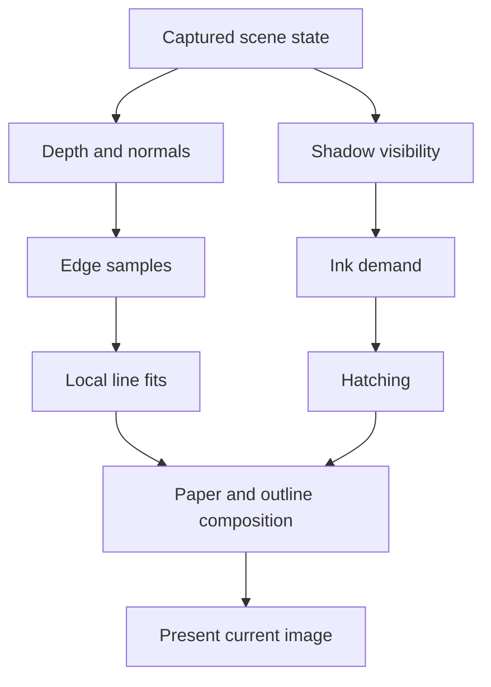

# Rendering

The renderer uses the current camera, scene and light state to compute shadows, strokes and contours on each requested frame. Stroke seeds stay fixed during motion.

## Surface coordinates

[`CitySurface.glsl`](../src/shaders/CitySurface.glsl) intersects each pixel ray with the geometric face plane. It derives position and pixel footprint from the same map. Mixing interpolated positions with unrelated analytical derivatives previously caused view-dependent errors.

Orbit views use orthographic rays. Walking uses a 60° vertical perspective camera with near/far planes at 0.03 and 40 scene units. Its ray direction varies across the image; differentiating the ray–plane intersection gives the local pixel footprint. Both camera types feed the same pencil kernels.

The chart axes stay fixed in world space. Camera motion changes their projection; light motion changes ink demand. Moving and deforming objects still need rest-space attachment.

## Lighting and shadows

[`CityLighting.glsl`](../src/shaders/CityLighting.glsl) separates direct visibility from pencil tone. `lightDirection` points from the surface toward the sun.

| View | Output |
|---|---|
| Light only | Unshadowed `max(dot(normal, light), 0)` |
| Raw shadows | White for visible direct sun; black for an occluder or reverse-facing surface |
| Pencil drawing | Surface illumination mapped to pencil tone |

The two diagnostic views omit paper grain, hatching, outlines and material color. Raw shadows displays visibility, rather than the stored depth texture.

The shadow pass uses conventional depth writes into a 1536² float32 map, hardware `LEQUAL` comparisons and nine weighted filter taps. Each comparison evaluates the receiving surface's plane at the actual texel center. Taps outside the light volume count as clear. The bias is independent of the camera.

Ground and flat decorative markings receive shadows; solid geometry casts them. City and sculpture use the same surface illumination: `max(dot(normal, light), 0) * visibility`. Darkness is one minus clamped illumination, and requested ink is `darkness * mix(0.38, 0.86, darkness)`, matching Unity's default style. Back-facing and fully occluded surfaces reach 0.86 ink, including ground. Dark facade details add a 0.70 material ink base using the same blend as Unity. Ground has no lighting exemption or distance-based fade to white.

The web sun has unit intensity and white light. Unity additionally accumulates multiple lights, supports optional ambient fill, attenuated paper color and stable artistic variation in point/spot falloff.

## Continuous rendering

Camera movement, zoom, relighting and style edits render on the next animation frame. Traffic uses continuous animation time. Idle web scenes skip unchanged work; there is no drawing-rate limit or delayed redraw timer. Unity renders every camera frame using transient Render Graph textures, without frame history. Stroke seeds do not advance automatically.

## Caching and sampling

| Cached result | Rebuild when |
|---|---|
| Shadow map | Light or casters move |
| Depth/normal data and line fits | Camera, viewport or geometry changes |
| Pencil shading | Scene, tone or sampling changes |
| Outline appearance | Seed, jitter or style changes |

A depth prepass rejects hidden pencil work. Chart-specific shader variants omit unused charts. Ground participates in the same shaded batches as other geometry across its full extent, retaining the same triangles as the depth pass. The former plain-paper ground pass and shadow-only scissor are removed because unshadowed ground can still require form shading.

Fast mode uses two pencil evaluations per output pixel and available MSAA coverage. Reference shades at 2× width and height, then resolves four samples. Outline data stays at 2× in either mode. Only tests read pixels back to the CPU.

Performance measurements should include the whole frame: shadows, shading, edge detection, fitting and composition. Software-GPU timing does not predict phone performance.

## Walking controls

[`first-person.js`](../src/web/first-person.js) owns keyboard, pointer and touch input. It integrates movement each animation frame; the renderer uses the current eye and look angles. Walking changes the camera, not the stroke seed.

The camera stays at a fixed eye height. Small movement steps and sliding collision use rectangles collected from the town's static box geometry. Low curbs remain walkable; cars are visual only. Losing focus, hiding the page or leaving the mode clears held input.
