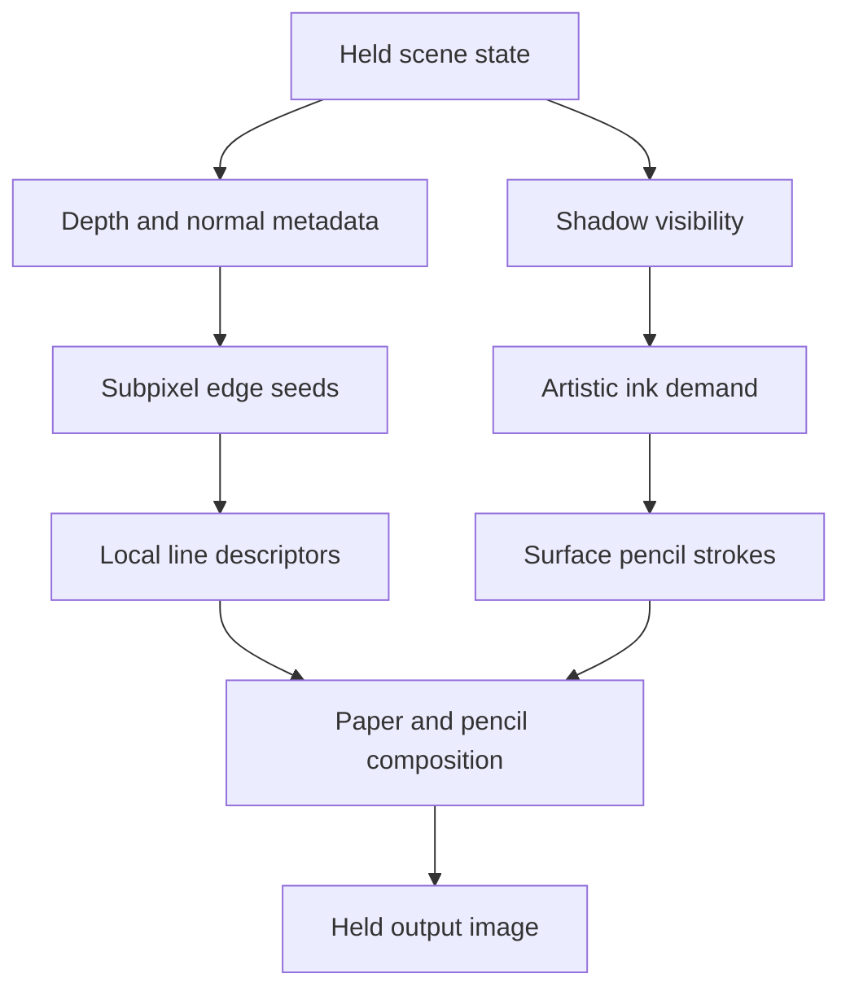

# Rendering and drawing contracts

The browser is a reference implementation, with a deliberately small procedural city. The portable ideas are the hatching kernel, the contour stages, the lighting-to-ink boundary and the complete-frame drawing policy.

## Coordinate contract

The city reconstructs a surface position by intersecting the orthographic pixel ray with the geometric face plane. [`CitySurface.glsl`](../src/shaders/CitySurface.glsl) derives position and pixel footprint from the same map. Mixing raster-interpolated coordinates with unrelated analytical derivatives previously caused view-dependent inconsistencies.

Coordinate axes are stable in world space. Camera motion changes projection and pixel footprint; light motion changes ink demand. Neither changes the surface chart basis. The present prototype does not solve rest-space attachment on deforming objects.

## Lighting contract

[`CityLighting.glsl`](../src/shaders/CityLighting.glsl) separates direct visibility from artistic tone. `lightDirection` points **from the surface toward the sun**.

| View | Meaning |
|---|---|
| Light only | Unshadowed `max(dot(normal, light), 0)` |
| Raw shadows | White for visible direct sun; black for an occluder or a reverse-facing surface |
| Pencil drawing | Art-directed form and cast-shadow demand passed to the pencil kernel |

Raw shadows is therefore a direct-sun visibility diagnostic, not a display of the stored depth texture. Both diagnostic views bypass paper, hatching, outlines and material color.

The shadow pass uses conventional depth writes, a 1536² float32 map, hardware `LEQUAL` comparisons and a fixed nine-tap weighted filter. Receiver depth is evaluated on the geometric plane at each actual texel center. Samples outside the light's XY or depth range contribute clear visibility; they do not stretch edge texels. The depth tolerance is camera-independent.

The large ground and flat decorative markings only receive shadows. Solid buildings, roofs, steps, awnings, benches and cars cast them. This distinction belongs in scene/material metadata, not in the pencil kernel. The tiny grazing-angle attenuation belongs only to artistic cast-shadow ink, keeping raw visibility interpretable.

The city intentionally gives unoccluded turning faces lighter ink demand (up to 0.38) than cast shadows (up to 0.86; ground 0.87). Those values are art direction, not a physically based light model.

## Time contract

| Change | Recompute image | New stroke variation seed |
|---|---|---|
| Zoom / study | At the next drawing tick | Yes |
| Orbit / light | At the next drawing tick | No |
| Traffic | Quantized scene time, next drawing tick | No |
| Style controls | At the next drawing tick | No |
| Idle | No | No |

With **Hold drawings** enabled, commits are spaced by at least 100 ms. A slow device may update less often. The last complete image remains visible between commits, with no blend, easing or temporal accumulation. Disable Hold for a continuous diagnostic with a fixed seed.

The browser retains its canvas contents. A Unity pipeline should retain an explicit completed drawing texture and blit it between ticks. Do not update shadows, transforms or camera matrices halfway through a drawing. UI can update at display rate outside the held scene layer.

## Work and cache ownership

| Stage | Invalidated by |
|---|---|
| Shadow map | Light or caster motion |
| Depth/normal metadata and fitted contours | Camera, viewport or geometry motion |
| Pencil shading | Held scene, ink demand or sampling changes |
| Pencil contour appearance | Drawing seed, jitter or outline style |

The renderer keeps a camera depth prepass, normal-specific chart variants and a conservative scissor around shadowed ground. The ground uses identical triangles in its depth and color passes. Rebuilding it as a different clipped mesh previously broke equal-depth testing.

Fast mode uses two pencil evaluations per native pixel and available MSAA coverage. Reference uses 2× shading resolution and resolves four samples. Outline metadata stays at 2× independently. No runtime CPU readback is part of rendering; tests use readbacks for evidence.

Keep future optimization claims tied to the complete frame, including shadow updates, metadata, fitting, mipmaps and composition. Browser software-GPU timing is not a mobile hardware benchmark.
