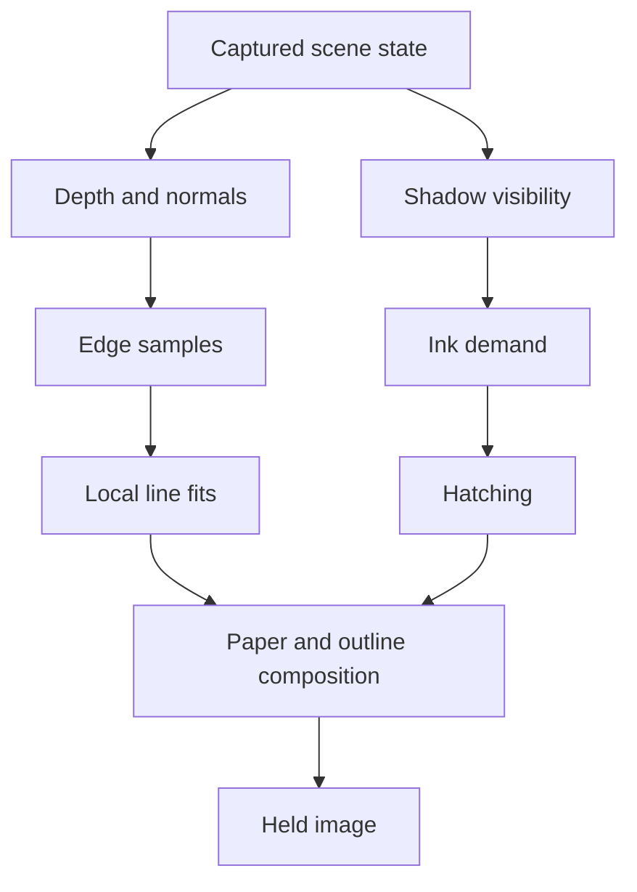

# Rendering

The renderer captures one scene state, computes its shadows and strokes, then holds the finished image until the next drawing tick.

## Surface coordinates

[`CitySurface.glsl`](../src/shaders/CitySurface.glsl) intersects each orthographic pixel ray with the geometric face plane. It derives position and pixel footprint from the same map. Mixing interpolated positions with unrelated analytical derivatives previously caused view-dependent errors.

The chart axes stay fixed in world space. Camera motion changes their projection; light motion changes ink demand. Moving and deforming objects still need rest-space attachment.

## Lighting and shadows

[`CityLighting.glsl`](../src/shaders/CityLighting.glsl) separates direct visibility from pencil tone. `lightDirection` points from the surface toward the sun.

| View | Output |
|---|---|
| Light only | Unshadowed `max(dot(normal, light), 0)` |
| Raw shadows | White for visible direct sun; black for an occluder or reverse-facing surface |
| Pencil drawing | Form and cast-shadow tone rendered as pencil |

The two diagnostic views omit paper grain, hatching, outlines and material color. Raw shadows displays visibility, rather than the stored depth texture.

The shadow pass uses conventional depth writes into a 1536² float32 map, hardware `LEQUAL` comparisons and nine weighted filter taps. Each comparison evaluates the receiving surface's plane at the actual texel center. Taps outside the light volume count as clear. The bias is independent of the camera.

Ground and flat decorative markings only receive shadows. Solid geometry casts them. A narrow grazing-angle attenuation applies to pencil tone only. Ordinary turning faces request at most 0.38 ink; cast shadows reach 0.86, or 0.87 on the ground. These values are art direction.

## Held drawings

| Change | Image update | New stroke seed |
|---|---|---|
| Zoom or scene | Next drawing tick | Yes |
| Orbit or light | Next drawing tick | No |
| Traffic | Next tick, using quantized scene time | No |
| Style controls | Next drawing tick | No |
| Idle | None | No |

Hold drawings spaces updates by at least 100 ms. Slower devices may take longer. Between updates, the canvas keeps the last complete image. Disable Hold for continuous inspection with a fixed seed.

A Unity port should keep the completed drawing in a persistent texture and display it between ticks. Capture transforms, camera and lights together. UI can remain at display rate outside the held scene image.

## Caching and sampling

| Cached result | Rebuild when |
|---|---|
| Shadow map | Light or casters move |
| Depth/normal data and line fits | Camera, viewport or geometry changes |
| Pencil shading | Scene, tone or sampling changes |
| Outline appearance | Seed, jitter or style changes |

A depth prepass rejects hidden pencil work. Chart-specific shader variants omit unused charts. Ground shading uses a conservative screen scissor around possible shadows, while retaining the same triangles as the depth pass. Retriangulating that ground previously broke equal-depth testing.

Fast mode uses two pencil evaluations per output pixel and available MSAA coverage. Reference shades at 2× width and height, then resolves four samples. Outline data stays at 2× in either mode. Only tests read pixels back to the CPU.

Performance measurements should include the whole frame: shadows, shading, edge detection, fitting and composition. Software-GPU timing does not predict phone performance.
